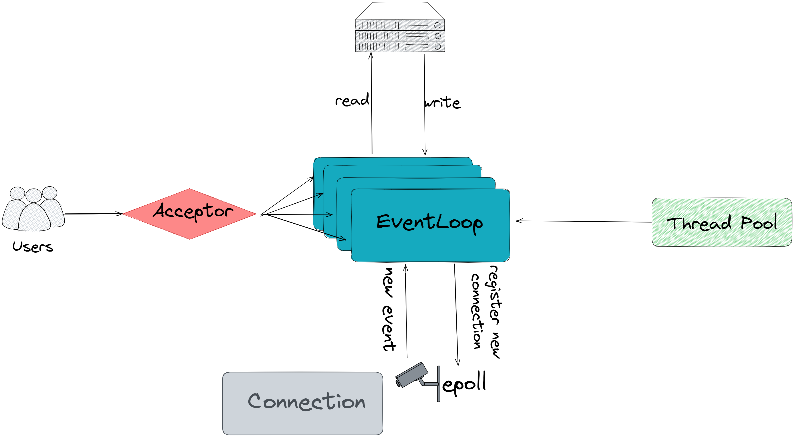

[](https://github.com/caaatch22/FalconLink/actions/workflows/build.yml)


## FalconLink
**FalconLink**是一个轻量级的高并发网络库。它封装了网络编程套接字API，将其抽象成一个易用，可拓展框架。用户只需通过设置回调函数的形式注入业务逻辑。它同时也具有 HTTP 服务请求与解析的功能。




上图是FalconLink系统架构的一个简单概括性图示。

- 采用**非阻塞socket**配合**边缘触发**，及*one loop per thread*的主从`reactor`设计
- `Acceptor` 是专门用于处理接受新用户连接请求的模块。它守候在监听端口。收到请求后建立 `Connection` 分配给 EventLoop。
- FalconLink 将每个 TCP连接抽象成一个 `Connection`，一个`Connection`对应一个连接 socket 套接字。用户可以为每一条Connection注册回调函数。
- 每个 `EventLoop` 都拥有一个 `Poller`。 `Poller` 负责监听已连接的套接字，将有事件触发的连接反馈给 `EventLoop`。
- `EventLoop`是该系统的核心组件, 每个都单独运行在一个线程中. 它从 `Poller` 中接收到有事件触发的用户连接后, 会获取并执行它们的回调函数.
- `ThreadPool` 线程池管理着系统中有多少个 `EventLoop` 在运行，并调度线程，防止注册过多线程导致性能下降。
- 支持 HTTP(GET,HEAD)请求的解析与回复，支持挂载静态 html 文件（本博客使用FalconLink的 HTTP 服务）


## API
使用falconlink，可以轻易且优雅的在20行内实现一个`echo server`。
```cpp
#include "falconlink.hpp"

int main() {
  falconlink::InetAddr local_address("0.0.0.0", 8090);
  falconlink::Server echo_server(local_address);
  echo_server
      .onHandle([&](falconlink::Connection* client_conn) {
        int from_fd = client_conn->fd();
        auto [read, exit] = client_conn->recv();
        if (exit) {
          client_conn->getEventLoop()->deleteConnection(from_fd);
          // client_conn ptr is invalid below here, do not touch it again
          return;
        }
        // 只有以下四行是业务逻辑
        if (read) {
          client_conn->WriteToWriteBuffer(client_conn->ReadAsString());
          client_conn->send();
          client_conn->clearReadBuffer();
        }
        
      })
      .start();
  return 0;
}

```


## Build
将代码clone到本地，进入主目录
```sh
sudo sh ./build_support/pachages.sh

mkdir build
cd build

cmake ..  # Debug mode by default
# or 
cmake -DCMAKE_BUILD_TYPE=Release .. # to use release mode

make

# test
make test
```


## Benchmark

```sh
make benchmark
```

+ **硬件**:  
  - Intel(R) Xeon(R) Gold 6148 CPU @ 2.40GHz
  - OS:Ubuntu 20.04 LTS, 
  - 4 核 CPU， 16GiB内存， 100GiB磁盘存储。

+ **QPS**: **40K**